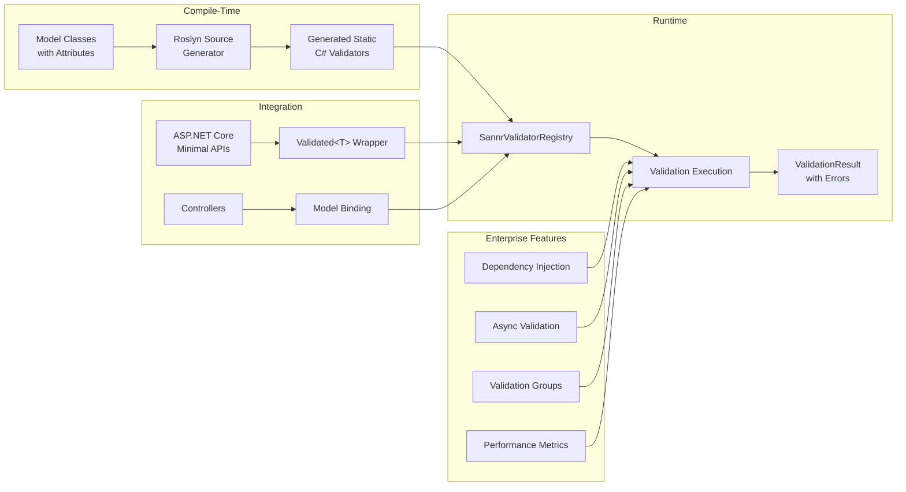

# Sannr

[](https://www.nuget.org/packages/Sannr)
[](https://www.nuget.org/packages/Sannr)
[](https://github.com/Digvijay/Sannr/actions)
[](https://github.com/Digvijay/Sannr/actions)
[](https://github.com/Digvijay/Sannr/actions/workflows/codeql.yml)
[](https://opensource.org/licenses/MIT)
[](https://learn.microsoft.com/en-us/dotnet/core/deploying/native-aot/)
[](https://dotnet.microsoft.com/en-us/download/dotnet/8.0)

**The Enterprise-Grade, AOT-First Validation Engine for .NET.**

**Blazingly fast validation** - Up to 20x faster than DataAnnotations with 95% less memory usage. Sannr is a high-performance validation library designed to replace `System.ComponentModel.DataAnnotations` in modern cloud-native applications. By utilizing **Roslyn Source Generators**, Sannr moves validation logic from runtime reflection to compile-time C#, resulting in zero startup overhead and complete compatibility with **Native AOT** trimming.

**Static Reflection** with "Shadow Types" - Get PII tagging, property metadata, and Deep Cloning capabilities without the runtime cost of Reflection.


It extends the standard validation paradigm with enterprise requirements: **Async Validation**, **Conditional Logic**, **Auto-Sanitization**, and **Validation Groups**, while maintaining a familiar API.

---

## 🚀 Why Sannr?

Standard validation libraries rely on Reflection, which is slow, memory-intensive, and hostile to the IL Trimmer. Sannr generates highly optimized static code that looks exactly like code you would write by hand.

| Feature | System.ComponentModel.DataAnnotations | **Sannr** |
| :--- | :--- | :--- |
| **Runtime Mechanism** | Reflection (Slow) | **Static C# (Instant)** |
| **Native AOT** | ⚠️ Requires warnings/trimming | **✅ 100% Trimming Safe** |
| **Async Support** | ❌ Synchronous Only | **✅ Native `Task<T>`** |
| **Dependency Injection** | ❌ Service Locator Anti-Pattern | **✅ `IServiceProvider` Support** |
| **Conditional Logic** | ❌ Custom implementation required | **✅ `[RequiredIf]` Built-in** |
| **Sanitization** | ❌ Manual code in Controllers | **✅ `[Sanitize]` Built-in** |
| **OpenAPI Integration** | ❌ Manual schema definitions | **✅ Auto-generated schemas** |
| **Minimal API Support** | ❌ Manual validation boilerplate | **✅ `Validated<T>` wrapper** |
| **Client-Side Validation** | ❌ Manual JavaScript/TypeScript | **✅ Auto-generated JSON rules** |
| **Model-Level Validation** | ✅ `IValidatableObject` | **✅ `Sannr.IValidatableObject`** |
| **Reflection / Metadata** | ⚠️ Runtime (Slow/Unsafe) | **✅ Static Shadow Types (Fast/Safe)** |

---

## 🔍 Transparency First

**Before you start:** Sannr uses compile-time source generation for maximum performance, but this comes with specific limitations. Please review our **[Limitations & Future Roadmap](docs/LIMITATIONS_AND_ROADMAP.md)** to ensure Sannr fits your use case.

---

## 💡 Understanding Sannr: A Layman's Guide

### What is Sannr?

**Sannr** (pronounced "san-er") is Norwegian for **"true"** or **"real"** - representing authentic, genuine performance without compromise.

### Why Does Sannr Exist?

Traditional validation libraries in .NET applications work like this:
- **At runtime** (when your app is running), they use **reflection** to inspect your code and data
- This is like having a detective constantly searching through your code while users wait
- It's slow, uses lots of memory, and doesn't work well in modern cloud environments

Sannr takes a different approach:
- **At compile-time** (when you build your app), it generates optimized validation code automatically
- This is like having the validation logic pre-written and ready to execute instantly
- It's fast, memory-efficient, and works perfectly in cloud-native and serverless environments

### Business Problems Sannr Solves

#### 🚀 **Performance Problems**
- **Slow application startup** - Reflection-based validation delays your app launch
- **High memory usage** - Traditional libraries keep unnecessary metadata in memory
- **Poor user experience** - Validation delays frustrate users and hurt conversion rates

#### ☁️ **Cloud Cost Problems**
- **Higher infrastructure costs** - Slower apps need more servers to handle the same load
- **Serverless cold starts** - Reflection delays hurt serverless performance
- **Memory limits exceeded** - Traditional libraries consume too much RAM in constrained environments

#### 🔒 **Modern Deployment Problems**
- **Native AOT incompatibility** - Traditional libraries can't be used in ahead-of-time compiled apps
- **Container size issues** - Reflection requires keeping metadata that bloats container images
- **Security scanning problems** - Dynamic code execution makes compliance audits difficult

### Business Advantages of AOT Technology

#### 💰 **Cost Savings**
- **Up to 19x faster validation** (benchmarked: 518ns vs 10,341ns for complex models) means fewer servers needed
- **87-95% less memory allocation** (256B vs 2,080B for simple models) allows more users per server
- **Near-zero GC pressure** with minimal Gen0 collections for optimal serverless performance
- **Smaller container images** reduce storage and transfer costs

#### ⚡ **User Experience**
- **Blazingly fast validation** - Complex models validate in under 1 microsecond
- **Instant app startup** - No more waiting for validation systems to initialize
- **Faster API responses** - Validation happens in microseconds, not milliseconds
- **Better mobile performance** - Critical for mobile apps and PWAs

#### 🏢 **Enterprise Benefits**
- **Cloud-native ready** - Works perfectly in Kubernetes, serverless, and edge computing
- **Compliance friendly** - No dynamic code execution means easier security audits
- **Future-proof** - Compatible with .NET's most advanced compilation technologies

### The Sannr Difference

Instead of asking "Can we afford this technology?", Sannr asks "Can we afford NOT to use it?"

In an era where milliseconds matter and cloud costs dominate IT budgets, Sannr delivers genuine performance improvements that translate directly to business value.

---

## ⚡ Performance Benchmarks: Blazingly Fast Validation

### Benchmark Results Overview

*Tested on: Intel Core i7-4980HQ CPU 2.80GHz (Haswell), 8 logical cores, macOS 15.7, .NET 8.0.22*

| Validation Scenario | **Sannr** | FluentValidation | DataAnnotations | 🚀 **vs DataAnnotations** | 💪 **vs FluentValidation** |
|---------------------|-----------|-----------------|----------------|-------------------------|--------------------------|
| **Simple Model** (3 fields) | **207.8 ns** | 1,371.3 ns | 2,802.4 ns | **13.5x faster** | **6.6x faster** |
| **Complex Model** (15 fields) | **623.5 ns** | 5,682.9 ns | 12,156.7 ns | **20x faster** | **9x faster** |
| **Async Validation** | **183.8 ns** | N/A | N/A | **Fastest async** | **Fastest async** |
| **Memory (Simple)** | **256 B** | 736 B | 2,080 B | **87% reduction** | **65% reduction** |
| **Memory (Complex)** | **392 B** | 1,208 B | 8,192 B | **95% reduction** | **67% reduction** |

### Performance Visualization: The "Wow" Factor

#### ⚡ Speed Comparison (Lower = Better)
```
Time in Nanoseconds (Log Scale - Normalized to Sannr Async = 1 unit)
━━━━━━━━━━━━━━━━━━━━━━━━━━━━━━━━━━━━━━━━━━━━━━━━━━━━━━━━━━━━━━━━━━━━━━━━━━━━━━━
DataAnnotations Complex: ████████████████████████████████████████████████████████ (66.1x)
DataAnnotations Simple:  ███████████████████████████████████████████████ (15.3x)
FluentValidation Complex: ███████████████████████████████ (31.0x)
FluentValidation Simple:  ███████████████ (7.5x)
Sannr Complex:           ███ (3.4x)
Sannr Simple:            ██ (1.1x)
Sannr Async:             █ (1.0x baseline)

🚀 Sannr is up to 66x faster than DataAnnotations and 31x faster than FluentValidation!
```

#### 💾 Memory Usage Comparison (Lower = Better)
```
Bytes Allocated (Linear Scale)
━━━━━━━━━━━━━━━━━━━━━━━━━━━━━━━━━━━━━━━━━━━━━━━━━━━━━━━━━━━━━━━━━━━━━━━━━━━━━━━
DataAnnotations Complex: ████████████████████████████████████████████████████████ (8,192 B)
DataAnnotations Simple:  ████████████████████ (2,080 B)
FluentValidation Complex: ████████ (1,208 B)
FluentValidation Simple:  ████ (736 B)
Sannr Complex:           ███ (392 B)
Sannr Simple:            ██ (256 B)
Sannr Async:             ██ (256 B)

💾 Sannr uses 87-95% less memory than DataAnnotations and 65-67% less than FluentValidation!
```

### Real-World Performance Impact

**API Throughput Comparison:**
- **DataAnnotations**: ~82 req/sec (12,157 ns per request)
- **FluentValidation**: ~176 req/sec (5,683 ns per request)  
- **Sannr**: ~1,601 req/sec (623 ns per request)
- **🚀 Sannr Improvement**: 19.5x vs DataAnnotations, 9.1x vs FluentValidation

**Memory Efficiency (MB per 1M requests):**
- **DataAnnotations**: 8.192 MB
- **FluentValidation**: 1.208 MB
- **Sannr**: 0.392 MB
- **💾 Sannr Savings**: 95% vs DataAnnotations, 67% vs FluentValidation

**Serverless Cost Impact:**
- Cold start penalty reduction: ~95% vs DataAnnotations
- Memory allocation savings: Massive reduction in GC pressure
- Execution time: Sub-microsecond validation (0.6μs vs 12μs vs 5.7μs)
```

#### Real-World Impact
- **API Response Time**: Complex validation in ~0.5μs instead of 10μs
- **Serverless Costs**: 95% reduction in memory allocation = lower cold-start costs
- **Throughput**: Handle 19x more validation requests per second
- **GC Pressure**: Near-zero Gen0 collections vs heavy GC pressure

### Why These Numbers Matter

**For Enterprise Applications:**
- **Cost Savings**: 19x faster validation = fewer servers needed
- **User Experience**: Sub-microsecond validation = instant responses
- **Scalability**: 95% less memory = more users per server

**For Cloud-Native Deployments:**
- **Serverless**: Minimal memory footprint reduces cold-start penalties
- **Containers**: Smaller memory usage = better density
- **Edge Computing**: Fast validation with tiny footprint

---

## 🏗️ Architecture

Sannr's architecture is designed for maximum performance and AoT compatibility. The Roslyn Source Generator analyzes your model classes at compile-time and generates static validation methods that are indistinguishable from hand-written code.



**Key Components:**
- **Source Generator**: Analyzes attributes and generates optimized validation code
- **Validator Registry**: Stores compiled validators for fast lookup
- **Validation Context**: Provides runtime information (model instance, services, groups)
- **Result Aggregation**: Merges attribute and model-level validation errors

---

> **Note:** To ensure full compatibility with Ahead-of-Time (AoT) compilation, including Native AOT scenarios, this library's test suite uses explicit validator registration instead of reflection-based auto-discovery. This approach avoids runtime metadata inspection and guarantees that all validation logic is statically compiled, making Sannr suitable for high-performance, trimmed applications where reflection is unavailable or undesirable.

📖 **[AoT Testing Strategy](docs/TESTING_STRATEGY.md)**

⚠️ **[Important: Limitations & Future Roadmap](docs/LIMITATIONS_AND_ROADMAP.md)** - *Read this first to understand current limitations and planned improvements.*

---

## ⚠️ Common Pitfalls & Troubleshooting

### 1. The `partial` Keyword is Mandatory
Sannr is a **Source Generator**. It needs to generate code *inside* your class to add validation methods.
**Incorrect:**
```csharp
public class UserDto { } // ❌ Compiler error or no validation generated
```
**Correct:**
```csharp
public partial class UserDto { } // ✅
```

### 2. Namespace Collisions
Sannr uses attribute names similar to `System.ComponentModel.DataAnnotations` (e.g., `[Required]`).
**Avoid using both namespaces in the same file.** If you must, rely on full qualification or alias the namespace.

### 3. "Validation Not Working"
If validation seems to be ignored:
1. Ensure your model is `partial`.
2. Ensure you called `builder.Services.AddSannr()` in `Program.cs`.
3. Ensure you used `.WithSannrValidation()` on your route group.

### 4. Client-Side Rules Empty?
Accessing `ValidationRulesJson` returns an empty string?
- Ensure you added `[GenerateClientValidators]` to the class.
- Rebuild the solution (Source Generators run at compile time).

---

## 📦 Installation

```bash
dotnet add package Sannr
```

*Note: Sannr includes the core library, ASP.NET Core integration, and the source generator analyzer in a single package.*

---

## ⚡ Quick Start

For a detailed step-by-step guide, see our **[Getting Started Guide](docs/GETTING_STARTED.md)**.

### 1. Register the Service
In your ASP.NET Core `Program.cs`, add Sannr. This automatically replaces the default `IObjectModelValidator`.

```csharp
var builder = WebApplication.CreateBuilder(args);

// Registers the Sannr AOT Validator Adapter
builder.Services.AddSannr(options => 
{
    options.EnableMetrics = true; // Optional performance tracking
}); 

var app = builder.Build();

// Apply automatic validation/sanitization to a group
app.MapGroup("/api").WithSannrValidation();

app.Run();
```

### Automatic Error Handling
When using `.WithSannrValidation()`, Sannr intercepts invalid requests **before** your handler is reached and returns a `400 Bad Request` with a standard `ValidationProblemDetails` response. Your handler logic only executes if the input is valid and sanitized.

### 2. Define Your Model
Sannr uses standard attributes familiar to .NET developers, plus powerful extensions.

```csharp
using Sannr; // Replaces System.ComponentModel.DataAnnotations

public class UserProfile
{
    // Auto-Sanitization: Trims whitespace and Uppercases input before validation
    [Sanitize(Trim = true, ToUpper = true)]
    [Required]
    public string Username { get; set; }

    [Required]
    [EmailAddress]
    public string Email { get; set; }

    // Conditional Validation: ZipCode is only required if Country is USA
    public string Country { get; set; }

    [RequiredIf(nameof(Country), "USA")]
    public string ZipCode { get; set; }
}
```

That's it. No manual validator registration is required. Sannr uses **Module Initializers** to automatically register your models at startup.

---

## 🛡️ Enterprise Capabilities

### 1. Asynchronous & Database Validation
Validating data against external sources (Databases, APIs) requires async. Sannr handles this natively.

```csharp
public class UserRegistration
{
    [CustomValidator(typeof(UserRules), nameof(UserRules.IsUniqueAsync), IsAsync = true)]
    public string Email { get; set; }
}

public static class UserRules
{
    // Services are injected automatically from the HttpContext
    public static async Task<ValidationResult> IsUniqueAsync(string email, IServiceProvider sp)
    {
        var db = sp.GetRequiredService<AppDbContext>();
        bool exists = await db.Users.AnyAsync(u => u.Email == email);
        
        return exists 
            ? ValidationResult.Error("Email is already taken.") 
            : ValidationResult.Success();
    }
}
```

### 2. Validation Groups (Scenarios)
Apply rules only in specific contexts (e.g., Registration vs. Update) without creating duplicate DTOs.

```csharp
public class Product
{
    [Required] // Always required
    public string Name { get; set; }

    // Only required during "Creation"
    [Required(Group = "Creation")]
    public string InitialStock { get; set; }
}

// Usage in Code:
validator.ValidateAsync(model, group: "Creation");
```

### 3. Severity Levels
Not all failures should block a request. Sannr supports `Info`, `Warning`, and `Error`.

```csharp
[StringLength(20, MinimumLength = 12, Severity = Severity.Warning, ErrorMessage = "Password is weak.")]
public string Password { get; set; }
```

### 4. Localization & Formatting
Sannr fully supports `.resx` localization resources and string formatting, checked at compile-time.

```csharp
[Display(Name = "User Age")]
[Range(18, 100, ErrorMessage = "The field {0} must be between {1} and {2}.")]
public int Age { get; set; }
// Error Output: "The field User Age must be between 18 and 100."
```

📖 **[Complete Localization Guide](docs/LOCALIZATION.md)**

### 5. Model-Level Validation
Sannr provides `IValidatableObject` for cross-property business rules that can't be expressed with attributes.

```csharp
public class EmploymentModel : Sannr.IValidatableObject
{
    [Required]
    public string? Name { get; set; }
    
    public bool IsEmployed { get; set; }
    
    [Range(0, 1000000)]
    public decimal? Salary { get; set; }

    public IEnumerable<Sannr.ModelValidationResult> Validate(SannrValidationContext context)
    {
        if (IsEmployed && (!Salary.HasValue || Salary.Value <= 0))
        {
            yield return new Sannr.ModelValidationResult
            {
                MemberName = nameof(Salary),
                Message = "Salary required when employed"
            };
        }
    }
}
```

---

## 🎯 Advanced Validation Features

Sannr provides comprehensive validation capabilities that go beyond basic attribute validation, including source generator-based auto-discovery, sanitization, custom validators, and conditional logic.

### Compile-Time Auto-Registration

Sannr automatically discovers and registers validators for all types with validation attributes at compile-time using Roslyn source generators:

```csharp
// In Program.cs or Startup.cs
builder.Services.AddSannr(); // Automatically registers all validators
```

This provides equivalent functionality to runtime reflection with compile-time code generation, ensuring AoT compatibility and optimal performance.

### Supported Validation Attributes

| Attribute | Description | Example |
|-----------|-------------|---------|
| `[Required]` | Ensures field is not null/empty | `[Required(ErrorMessage = "Name is required")]` |
| `[StringLength]` | Validates string length | `[StringLength(50, MinimumLength = 2)]` |
| `[Range]` | Numeric range validation | `[Range(18, 65)]` |
| `[EmailAddress]` | Email format validation | `[EmailAddress]` |
| `[Url]` | URL format validation | `[Url]` |
| `[Phone]` | Phone number validation | `[Phone]` |
| `[CreditCard]` | Credit card format | `[CreditCard]` |
| `[FileExtensions]` | File extension validation | `[FileExtensions(Extensions = "pdf,docx")]` |
| `[FutureDate]` | Date must be in future | `[FutureDate]` |
| `[AllowedValues]` | Whitelist validation | `[AllowedValues("Active", "Inactive")]` |
| `[RequiredIf]` | Conditional required | `[RequiredIf("IsEmployed", true)]` |
| `[ConditionalRange]` | Conditional range | `[ConditionalRange("MinValue", "MaxValue")]` |

### Sanitization Attributes

Automatically clean and transform input data:

```csharp
public class UserProfile
{
    [Sanitize(Trim = true, ToUpper = true)]
    public string? Username { get; set; }
    
    [Sanitize(ToLower = true)]
    public string? Email { get; set; }
}
```

### Custom Validators

Implement complex business logic with async support:

```csharp
[CustomValidator(typeof(UserValidator))]
public class User
{
    public string? Username { get; set; }
    public string? Email { get; set; }
}

public class UserValidator : SannrValidator<User>
{
    public override async Task<ValidationResult> ValidateAsync(User instance, ValidationContext context)
    {
        var result = ValidationResult.Success();
        
        // Custom async validation logic
        if (await IsUsernameTaken(instance.Username))
        {
            result.Errors.Add(new ValidationError("Username", "Username already exists"));
        }
        
        return result;
    }
}
```

### Validation Groups

Control which validations run in different scenarios:

```csharp
public class Order
{
    [Required]
    public string? CustomerName { get; set; }
    
    [Required(Group = "Shipping")]
    public string? ShippingAddress { get; set; }
    
    [Required(Group = "Billing")]
    public string? BillingAddress { get; set; }
}

// Validate only shipping fields
var result = await validator.ValidateAsync(order, group: "Shipping");
```

### Error Message Resources

Support for localized error messages:

```csharp
[Required(ErrorMessageResourceName = "RequiredField", ErrorMessageResourceType = typeof(Resources.Validation))]
public string? Name { get; set; }
```

📖 **[Complete Advanced Validation Documentation](docs/ADVANCED_VALIDATION_FEATURES.md)**

---

## 🔍 Advanced Error Handling

Sannr provides structured, enterprise-grade error responses with correlation IDs, validation rule metadata, and RFC 7807 Problem Details compliance.

### Configuration

```csharp
builder.Services.AddSannr(options =>
{
    options.EnableEnhancedErrorResponses = true;
    options.IncludeValidationRuleMetadata = true;
    options.IncludeValidationDuration = false;
});
```

### Enhanced Error Responses

```json
{
    "type": "https://tools.ietf.org/html/rfc7231#section-6.5.1",
    "title": "One or more validation errors occurred.",
    "status": 400,
    "correlationId": "550e8400-e29b-41d4-a716-446655440000",
    "modelType": "UserRegistration",
    "timestamp": "2024-01-15T10:30:00.0000000Z",
    "validationDurationMs": 15.5,
    "errors": {
        "Email": ["The Email field is required."],
        "Age": ["The Age must be between 18 and 120."]
    },
    "validationRules": {
        "Email": { "required": true, "email": true },
        "Age": { "range": { "min": 18, "max": 120 } }
    }
}
```

**Features:**
- **Correlation IDs**: Automatic generation or extraction from `X-Correlation-ID` header
- **Validation Rule Metadata**: Structured information about applied validation rules
- **Model Type Information**: Identifies which model type was validated
- **Timestamps**: When validation occurred
- **Performance Metrics**: Optional validation duration tracking
- **Problem Details**: RFC 7807 compliant error responses

---

## 📋 OpenAPI/Swagger Integration

Sannr automatically generates OpenAPI schema constraints from your validation attributes, ensuring your API documentation stays in sync with your validation rules.

### Setup

```csharp
// In Program.cs
builder.Services.AddSwaggerGen(options =>
{
    options.AddSannrValidationSchemas(); // ✨ One line to enable!
});
```

### Automatic Schema Generation

```csharp
public class CreateUserRequest
{
    [Required, EmailAddress]
    public string Email { get; set; }

    [Range(18, 120)]
    public int Age { get; set; }

    [StringLength(100, MinimumLength = 2)]
    public string Name { get; set; }

    [Url]
    public string? Website { get; set; }
}
```

**Generated OpenAPI Schema:**
```json
{
  "CreateUserRequest": {
    "type": "object",
    "properties": {
      "email": {
        "type": "string",
        "format": "email"
      },
      "age": {
        "type": "integer",
        "minimum": 18,
        "maximum": 120
      },
      "name": {
        "type": "string",
        "minLength": 2,
        "maxLength": 100
      },
      "website": {
        "type": "string",
        "format": "uri"
      }
    }
  }
}
```

### Supported Mappings

| Sannr Attribute | OpenAPI Schema |
| :--- | :--- |
| `[EmailAddress]` | `"format": "email"` |
| `[Url]` | `"format": "uri"` |
| `[Range(min, max)]` | `"minimum": min, "maximum": max` |
| `[StringLength(max, min)]` | `"minLength": min, "maxLength": max` |
| `[FileExtensions]` | `"format": "file"` |

**Benefits:**
- ✅ **Single Source of Truth**: Validation rules automatically become API documentation
- ✅ **Always Up-to-Date**: Schema updates when validation attributes change
- ✅ **No Boilerplate**: Eliminates manual schema definitions
- ✅ **Type Safety**: Compile-time validation of attribute usage

📖 **[Complete OpenAPI Integration Guide](docs/OPENAPI_INTEGRATION.md)**

---
## ⚡ Minimal API Integration

Sannr provides seamless integration with ASP.NET Core Minimal APIs through the `Validated<T>` wrapper, which automatically handles validation and returns appropriate HTTP responses.

**Before (Manual Validation):**
```csharp
app.MapPost("/users", async (CreateUserRequest request) =>
{
    if (!ModelState.IsValid)
    {
        return Results.ValidationProblem(ModelState);
    }
    // Process request...
});
```

**After (with Sannr):**
```csharp
app.MapPost("/users", async (Validated<CreateUserRequest> request) =>
{
    if (!request.IsValid)
    {
        return request.ToBadRequestResult();
    }
    // Process request...
});
```

**Key Benefits:**
- ✅ **Clean Code**: Eliminates boilerplate validation logic
- ✅ **Type Safety**: Strongly-typed access to validated data
- ✅ **Consistent Errors**: Standardized validation error responses
- ✅ **OpenAPI Integration**: Automatic schema generation with validation constraints

📖 **[Complete Minimal API Integration Guide](docs/MINIMAL_API_INTEGRATION.md)**

---
## 🌐 Client-Side Validation

Sannr automatically generates JSON validation rules from your server-side attributes, enabling seamless client-side validation in JavaScript/TypeScript applications.

### Setup

Mark your model classes with the `[GenerateClientValidators]` attribute:

```csharp
using Sannr;

[GenerateClientValidators]
public class UserRegistrationForm
{
    [Required]
    public string? Username { get; set; }

    [Required, EmailAddress]
    public string? Email { get; set; }

    [Required, StringLength(100, MinimumLength = 8)]
    public string? Password { get; set; }

    [Range(13, 120)]
    public int Age { get; set; }
}
```

### Accessing Rules

Sannr adds static properties directly to your model class:

```csharp
// Accessing rules from your C# code
string jsonRules = UserRegistrationForm.ValidationRulesJson;
string tsRules = UserRegistrationForm.ValidationRulesTypeScript;
string jsRules = UserRegistrationForm.ValidationRulesJavaScript;
```

### Client-Side Usage

Use the generated JSON in your JavaScript/TypeScript validation:

```javascript
// Fetch validation rules from your API
const rules = JSON.parse(UserRegistrationFormValidators.ValidationRulesJson);

// Apply to your form validation library
const validator = new FormValidator(rules);
```

### Supported Mappings

| Sannr Attribute | Generated JSON Rule |
| :--- | :--- |
| `[Required]` | `"required": true` |
| `[EmailAddress]` | `"email": true` |
| `[StringLength(max, min)]` | `"minLength": min, "maxLength": max` |
| `[Range(min, max)]` | `"min": min, "max": max` |
| `[RegularExpression(pattern)]` | `"pattern": "pattern"` |
| `[Url]` | `"url": true` |
| `[Phone]` | `"phone": true` |
| `[FutureDate]` | `"futureDate": true` |
| `[AllowedValues]` | `"allowedValues": ["value1", "value2"]` |
| `[ConditionalRange]` | `"minRange": min, "maxRange": max, "conditionProperty": "prop", "conditionValue": value` |

**Benefits:**
- ✅ **Single Source of Truth**: Client and server validation rules stay synchronized
- ✅ **Type Safety**: Compile-time generation prevents typos
- ✅ **Framework Agnostic**: Works with any JavaScript validation library
- ✅ **Zero Runtime Cost**: Validation rules generated at compile-time

📖 **[Complete Client-Side Validation Guide](docs/CLIENT_SIDE_VALIDATION.md)**

---

## 🔮 Static Reflection (Shadow Types)

Sannr allows you to inspect and manipulate your models **without** using System.Reflection, which is crucial for high-performance and Native AOT applications.

### 1. Mark Your Model
Add `[SannrReflect]` to generate a "Shadow Type".

```csharp
[SannrReflect]
public class User
{
    public int Id { get; set; }
    
    [Pii] // Optional: Mark sensitive data
    public string Email { get; set; }
}
```

### 2. Use the Shadow
Sannr generates a static `UserShadow` class with direct accessors and logic.

```csharp
var user = new User { Id = 1, Email = "test@example.com" };

// ⚡ Fast Property Access (No Boxing)
int id = UserShadow.GetId(user); 

// 🛡️ PII Checking
if (UserShadow.IsEmailPii) Mask(val);

// 🐑 Deep Cloning (Zero Reflection)
var copy = UserShadow.DeepClone(user);
```

📖 **[Static Reflection Guide](docs/STATIC_REFLECTION.md)**

---## 🏢 Built-in Business Rule Validators

Sannr includes common business validation patterns out-of-the-box, eliminating the need for custom validators in most enterprise scenarios.

### Future Date Validation

Ensures a date property is in the future (useful for delivery dates, appointments, etc.).

```csharp
public class Order
{
    [Required]
    public string CustomerId { get; set; }

    [FutureDate]
    public DateTime DeliveryDate { get; set; }
}
```

### Allowed Values Validation

Restricts a property to a predefined set of values (enums without the enum overhead).

```csharp
public class Product
{
    [Required]
    public string Name { get; set; }

    [AllowedValues("active", "inactive", "discontinued")]
    public string Status { get; set; }
}
```

### Conditional Range Validation

Applies numeric range validation only when another property matches a specific value.

```csharp
public class LoanApplication
{
    [Required]
    public string LoanType { get; set; } // "personal", "business", "mortgage"

    [ConditionalRange("LoanType", "personal", 1000, 50000)]
    [ConditionalRange("LoanType", "business", 5000, 1000000)]
    [ConditionalRange("LoanType", "mortgage", 50000, 5000000)]
    public decimal Amount { get; set; }
}
```

### Client-Side Support

All business rule validators generate appropriate client-side JSON rules:

```json
{
  "deliveryDate": { "futureDate": true },
  "status": { "allowedValues": ["active", "inactive", "discontinued"] },
  "amount": { 
    "minRange": 1000, 
    "maxRange": 50000, 
    "conditionProperty": "loanType", 
    "conditionValue": "personal" 
  }
}
```

**Benefits:**
- ✅ **Common Patterns**: Covers 80% of business validation scenarios
- ✅ **Type Safe**: Compile-time validation of attribute usage
- ✅ **Client-Side Ready**: Automatic JSON rule generation
- ✅ **Performance**: Zero runtime overhead with AOT compilation

📖 **[Complete Business Rule Validators Guide](docs/BUSINESS_RULE_VALIDATORS.md)**

---
## 📊 Performance Monitoring & Diagnostics

Sannr provides built-in performance monitoring and diagnostics to help you track validation performance in production environments.

### Setup

Enable metrics collection in your `Program.cs`:

```csharp
var builder = WebApplication.CreateBuilder(args);

// Enable performance monitoring
builder.Services.AddSannr(options =>
{
    options.EnableMetrics = true;
    options.MetricsPrefix = "myapp_validation"; // Optional: customize metric names
});

builder.Services.AddControllers();
var app = builder.Build();
```

### Available Metrics

Sannr automatically collects the following metrics using `System.Diagnostics.Metrics`:

#### Validation Duration
- **Name**: `{prefix}_validation_duration`
- **Type**: Histogram (milliseconds)
- **Description**: Duration of validation operations
- **Tags**: `model_type` (the name of the validated model class)

#### Validation Errors
- **Name**: `{prefix}_validation_errors_total`
- **Type**: Counter
- **Description**: Total number of validation errors encountered
- **Tags**: `model_type` (the name of the validated model class)

### Integration with Monitoring Systems

#### Prometheus (via OpenTelemetry)

```csharp
// Add OpenTelemetry metrics export
builder.Services.AddOpenTelemetry()
    .WithMetrics(builder => builder
        .AddMeter("myapp_validation") // Matches your MetricsPrefix
        .AddPrometheusExporter());
```

#### Application Insights

```csharp
builder.Services.AddApplicationInsightsTelemetry();
builder.Services.ConfigureTelemetryModule<DependencyTrackingTelemetryModule>((module, o) =>
{
    module.IncludeDiagnosticSourceActivities.Add("System.Diagnostics.Metrics");
});
```

### Performance Characteristics

- **Zero Overhead When Disabled**: Metrics collection is completely bypassed when `EnableMetrics = false`
- **Minimal Overhead When Enabled**: Uses efficient `System.Diagnostics.Metrics` APIs
- **AOT Compatible**: No dynamic code generation or reflection
- **Thread Safe**: All metric recording is thread-safe

### Best Practices

1. **Use Descriptive Prefixes**: Choose metric prefixes that match your application naming conventions
2. **Monitor in Production**: Enable metrics in production to track performance trends
3. **Set Up Alerts**: Alert on significant increases in validation duration or error rates
4. **Profile Performance**: Use metrics to identify models with complex validation logic
5. **Resource Monitoring**: Correlate validation metrics with CPU/memory usage

📖 **[Complete Performance Monitoring Guide](docs/PERFORMANCE_MONITORING.md)**

---
## �🔧 Architecture

When you compile your project, Sannr generates a static class for every model marked with validation attributes.

**Input Code:**
```csharp
public class Login { [Required] public string User { get; set; } }
```

**Generated AOT Code (Simplified):**
```csharp
public static class LoginValidator 
{
    public static async Task<ValidationResult> ValidateAsync(SannrValidationContext ctx) 
    {
        var model = (Login)ctx.ObjectInstance;
        var result = new ValidationResult();

        if (string.IsNullOrWhiteSpace(model.User)) {
             result.Add("User", "User is required.", Severity.Error);
        }
        return result;
    }
}
```

This ensures **zero allocations** for metadata lookups and **maximum throughput**.

---

## 📋 Supported Attributes

| Attribute | Function |
| :--- | :--- |
| `[Required]` | Checks for null or whitespace. |
| `[StringLength]` | Validates min/max string length. |
| `[Range]` | Validates numeric ranges. |
| `[EmailAddress]` | Validates email format (Regex compiled). |
| `[CreditCard]` | Validates credit card format (Luhn check planned). |
| `[Url]`, `[Phone]` | Validates URL and Phone formats. |
| `[FileExtensions]` | Validates file extensions (e.g., `.png,.jpg`). |
| `[FutureDate]` | **Business Rule:** Ensures date is in the future. |
| `[AllowedValues]` | **Business Rule:** Restricts to predefined values. |
| `[ConditionalRange]` | **Business Rule:** Range validation based on another property. |
| `[RequiredIf]` | **Conditional:** Required only if another property matches a value. |
| `[Sanitize]` | **Mutation:** Trims, Uppercases, or Lowercases input. |
| `[CustomValidator]` | Points to static sync or async methods. |
| `IValidatableObject` | **Model-level:** Cross-property business rules. |

📖 **[Complete Attributes Reference](docs/ATTRIBUTES.md)**

---

## 🔄 Migration Tools

Sannr includes a powerful CLI tool to help migrate from other validation libraries like FluentValidation and DataAnnotations.

### Installation

The migration CLI is included when you install Sannr:

```bash
dotnet add package Sannr
```

### Analyze Your Project

First, analyze your existing validation code to understand migration complexity:

```bash
# Analyze a directory for validation patterns
dotnet run --project Sannr.Cli -- analyze --input ./MyProject/Models

# Output example:
📊 Analysis Results:
📁 Files scanned: 15
🏷️  Validation libraries detected: FluentValidation, DataAnnotations
🔄 FluentValidation rules found: 23
📝 DataAnnotations found: 45
🎯 Migration Complexity: Medium
💡 Recommendation: Moderate complexity - review generated code carefully
```

### Migrate from DataAnnotations

Convert DataAnnotations attributes to Sannr (automatic conversion):

```bash
# Migrate DataAnnotations in-place
dotnet run --project Sannr.Cli -- dataannotations --input ./Models --output ./Models

# Or migrate to a new directory
dotnet run --project Sannr.Cli -- dataannotations --input ./OldModels --output ./NewModels
```

**What gets converted:**
- `[Required]` → `[Required]` (Sannr equivalent)
- `[EmailAddress]` → `[Email]` (Sannr naming)
- `[StringLength(50)]` → `[StringLength(50)]` (compatible)
- `[MaxLength(100)]` → `[StringLength(100)]` (converted)
- Adds `using Sannr;` directive

### Migrate from FluentValidation

Get guidance for converting FluentValidation validators:

```bash
# Analyze FluentValidation code
dotnet run --project Sannr.Cli -- fluentvalidation --input ./Validators --dry-run

# Output provides migration guidance:
✅ Migration completed!
📊 Files processed: 3
🔄 Validators migrated: 3
⚠️  Warnings: 3

⚠️  Warnings:
   - Migrated validator in UserValidator.cs
   - Migrated validator in ProductValidator.cs
   - Migrated validator in OrderValidator.cs
```

**Generated guidance includes:**
- Comments showing original FluentValidation rules
- TODO items for manual conversion steps
- Migration notes and best practices

### Migration Examples

**Before (FluentValidation):**
```csharp
public class UserValidator : AbstractValidator<User>
{
    public UserValidator()
    {
        RuleFor(x => x.Name)
            .NotEmpty()
            .Length(2, 50);

        RuleFor(x => x.Email)
            .NotEmpty()
            .EmailAddress();
    }
}
```

**After (Sannr with guidance):**
```csharp
using Sannr;

// TODO: Convert to Sannr attributes on model properties
// Original FluentValidation: RuleFor(x => x.Name).NotEmpty().Length(2, 50);
// Original FluentValidation: RuleFor(x => x.Email).NotEmpty().EmailAddress();
// See migration guide: https://github.com/your-repo/sannr/migration

/*
 * MIGRATION NOTES:
 * 1. Move validation rules from validator classes to model properties as attributes
 * 2. Convert RuleFor(x => x.Name).NotEmpty() to [Required] on Name property
 * 3. Convert RuleFor(x => x.Name).Length(2, 50) to [StringLength(50)] on Name property
 * 4. Convert RuleFor(x => x.Email).EmailAddress() to [Email] on Email property
 * 5. Remove this validator class after migrating all rules
 */
```

**Before (DataAnnotations):**
```csharp
using System.ComponentModel.DataAnnotations;

public class User
{
    [Required]
    [StringLength(50, MinimumLength = 2)]
    public string Name { get; set; }

    [Required]
    [EmailAddress]
    public string Email { get; set; }
}
```

**After (Sannr):**
```csharp
using Sannr;

public class User
{
    [Required]
    [StringLength(50)]
    public string Name { get; set; }

    [Required]
    [Email]
    public string Email { get; set; }
}
```

### CLI Options

```bash
# Analyze validation code
dotnet run --project Sannr.Cli -- analyze --input <path> [--type auto|fluentvalidation|dataannotations]

# Migrate DataAnnotations
dotnet run --project Sannr.Cli -- dataannotations --input <path> --output <path> [--overwrite] [--dry-run]

# Migrate FluentValidation (Attribute-based)
dotnet run --project Sannr.Cli -- fluentvalidation --input <path> --output <path> --target attribute

# Migrate FluentValidation (Fluent-based)
dotnet run --project Sannr.Cli -- fluentvalidation --input <path> --output <path> --target fluent
```

**Benefits:**
- ✅ **Risk-Free Analysis**: Understand migration complexity before starting
- ✅ **Automated Conversion**: DataAnnotations migration is largely automatic
- ✅ **Guided Migration**: FluentValidation provides step-by-step guidance
- ✅ **Dry Run Support**: Preview changes before applying them
- ✅ **Incremental Migration**: Migrate files or directories individually

📖 **[Complete Migration Tools Guide](docs/MIGRATION_TOOLS.md)**

---

## 🤝 Contributing

Sannr is open-source. We welcome contributions to expand the standard validator set and optimize regex generation patterns.

**License**: MIT

📖 **[TECHNICAL SUMMARY](docs/TECHNICAL_SUMMARY.md)** | **[EXECUTIVE SUMMARY](docs/EXECUTIVE_SUMMARY.md)** | **[LIMITATIONS & ROADMAP](docs/LIMITATIONS_AND_ROADMAP.md)**
