# Testing Strategy for AoT Compatibility

## Overview

Sannr's test suite is designed with a focus on Ahead-of-Time (AoT) compilation compatibility, ensuring that the library can be used in high-performance, trimmed environments where runtime reflection is unavailable or undesirable. This document outlines our testing strategy, the rationale behind it, and the architectural considerations that guide our approach.

## Why Explicit Validator Registration?

Traditional validation libraries, such as `System.ComponentModel.DataAnnotations`, rely heavily on runtime reflection to discover and execute validation logic. While convenient, this approach has several drawbacks in modern .NET applications:

- **Performance Impact**: Reflection introduces startup overhead and runtime performance penalties.
- **AoT Incompatibility**: Native AoT compilation trims unused code and metadata, making reflection-based discovery unreliable or impossible.
- **Memory Footprint**: Reflection requires keeping metadata in memory, increasing the application's footprint.

Sannr addresses these issues by generating static C# code at compile-time using Roslyn Source Generators. However, to fully embrace AoT principles, our test suite uses **explicit validator registration** instead of relying on any form of auto-discovery.

## Testing Strategy

### Core Principles

1. **AoT-First Design**: All tests must pass in environments where reflection is disabled.
2. **Explicit Registration**: Validators are manually registered using `SannrValidatorRegistry.Register<T>()`.
3. **Static Code Generation**: Validation logic is compiled into static methods, not discovered at runtime.
4. **Comprehensive Coverage**: Every model type used in tests has an explicitly registered validator.

### Implementation Details

#### Validator Registration

In test setup, we explicitly register validators for all model types:

```csharp
public static void RegisterTestValidators()
{
    SannrValidatorRegistry.Register<UserProfile>(async (context) => {
        // Explicit validation logic implementation
        var result = new ValidationResult();
        var model = (UserProfile)context.ObjectInstance;
        
        // Manual attribute handling
        if (string.IsNullOrWhiteSpace(model.Username))
            result.Add("Username", "Username is required");
        
        return result;
    });
}
```

This approach ensures:
- Zero reflection usage
- Predictable performance
- Full AoT compatibility
- Clear, auditable validation logic

#### Test Organization

- **FullTestSuite.cs**: Contains explicit validator registrations and comprehensive validation tests.
- **RealWorldIntegrationTests.cs**: Tests complex scenarios with registered validators.
- **MinimalApiIntegrationTests.cs**: Validates ASP.NET Core integration with explicit setup.
- **PerformanceMonitoringTests.cs**: Ensures metrics collection works with static validators.

### Architecture Diagram

```mermaid
graph TB
    subgraph "Compile-Time (Source Generation)"
        SG[Roslyn Source Generator] --> SC[Static C# Validators]
        SC --> REG[SannrValidatorRegistry]
    end
    
    subgraph "Runtime (AoT Compatible)"
        REG --> VAL[Validation Execution]
        VAL --> RES[ValidationResult]
    end
    
    subgraph "Testing Strategy"
        EXP[Explicit Registration] --> REG
        EXP --> TEST[Test Methods]
        TEST --> ASSERT[Assertions]
    end
    
    subgraph "Traditional Approach (Reflection)"
        REF[Reflection Discovery] -.-> X[❌ AoT Incompatible]
    end
    
    SG --> EXP
    VAL --> TEST
```



### Benefits of This Approach

- **Performance**: No runtime discovery overhead
- **Reliability**: Deterministic validation behavior
- **Compatibility**: Works in Native AoT, WASM, and trimmed environments
- **Maintainability**: Clear, explicit validation logic
- **Security**: No dynamic code execution risks

### Challenges and Solutions

| Challenge | Solution |
|-----------|----------|
| Verbose Registration | Centralized in `RegisterTestValidators()` |
| Attribute Duplication | Manual implementation ensures accuracy |
| Maintenance Overhead | Automated test generation scripts |
| Learning Curve | Comprehensive documentation and examples |

### Future Considerations

As .NET's AoT capabilities evolve, we may explore hybrid approaches that combine explicit registration with limited reflection in non-AoT scenarios. However, our current strategy ensures maximum compatibility across all deployment targets.

## Conclusion

By adopting explicit validator registration in our testing strategy, Sannr maintains its commitment to high-performance, AoT-compatible validation. This approach not only ensures compatibility with modern .NET deployment scenarios but also provides a clear, maintainable foundation for enterprise-grade validation logic.</content>
<parameter name="filePath">/Users/digvijay/source/github/Sannr/docs/TESTING_STRATEGY.md